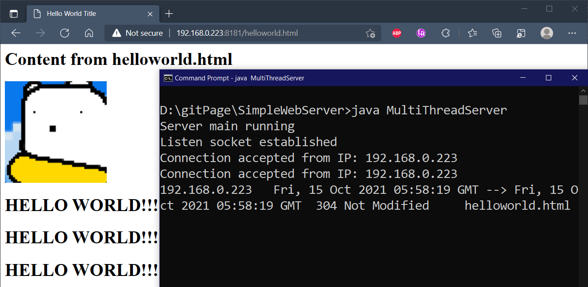
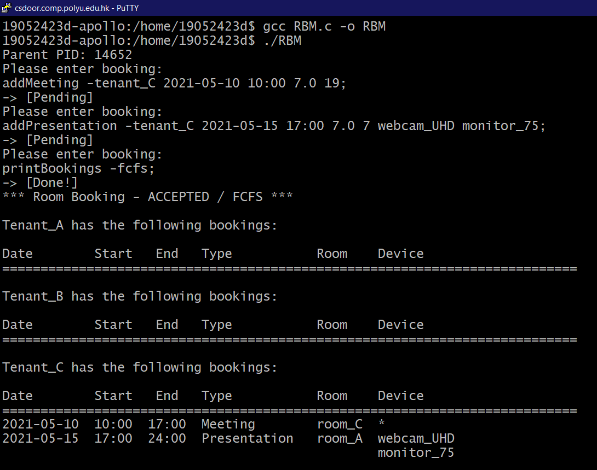

## Academic Projects

- [Comp Virtual File System](https://github.com/LammyLam/portfolio/tree/master/CompVirtualFileSystem)
    - Written in Java
    - Simulated a file system environment
    - Applied OOP principles extensively
    - Used MVC pattern

* * *

- [Simple Web Server](https://github.com/LammyLam/portfolio/tree/master/SimpleWebServer) 
    - Written in Java 
    - Used Web Socket
    - Multithreaded
    - Handled HTTP requests and headers
  
  
* * *

- [Room Booking System](https://github.com/LammyLam/portfolio/tree/master/RoomBookingManager) 
    - Written in C
    - Used system calls featured in Linux
    - Used interprocess communication techniques
    - Made use of process scheduling algorithms in operating systems

