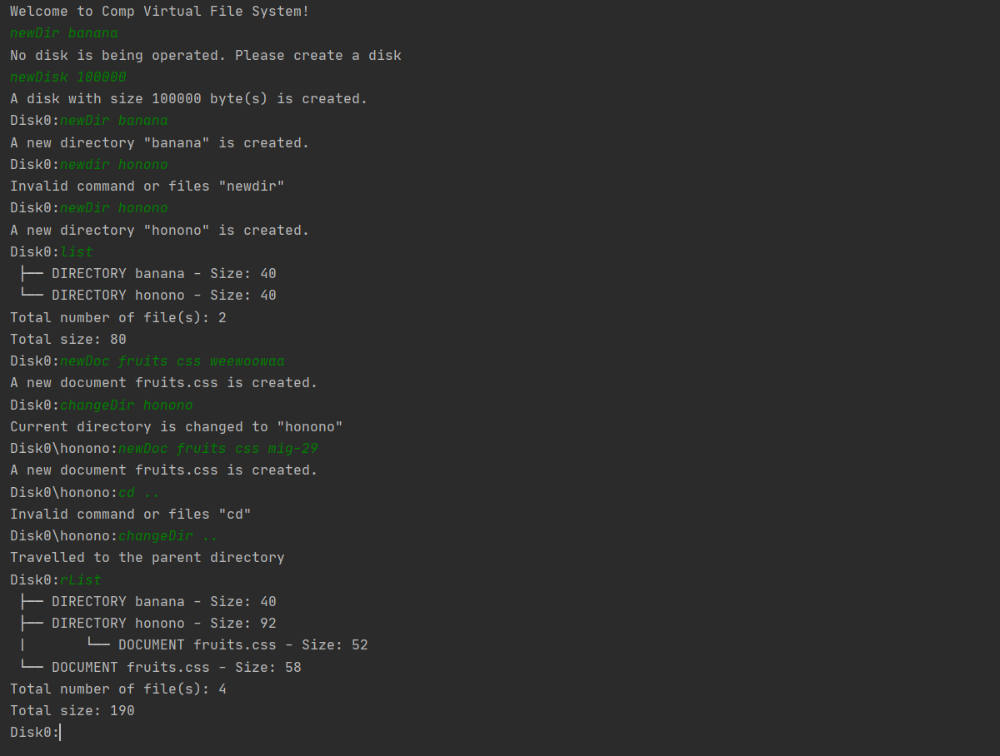
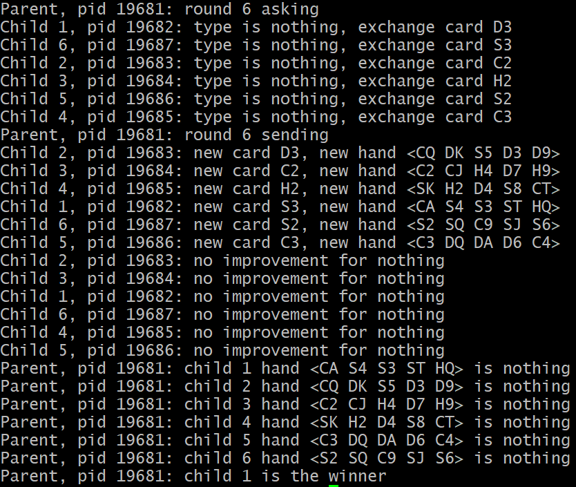

## Academic Projects
_Click the titles to know more about the projects!_

- [Comp Virtual File System](https://github.com/LammyLam/portfolio/tree/master/CompVirtualFileSystem) 
    - Written in Java
    - Simulated a file system environment
    - Applied OOP principles extensively
    - Used MVC pattern
  
  
  

* * *

- [Simple Web Server](https://github.com/LammyLam/portfolio/tree/master/SimpleWebServer) 
    - Written in Java 
    - Used Web Socket
    - Multithreaded
    - Handled HTTP requests and headers
  

* * *

- [Room Booking System](https://github.com/LammyLam/portfolio/tree/master/RoomBookingManager) 
    - Written in C
    - Used system calls featured in Linux
    - Used interprocess communication techniques
    - Made use of process scheduling algorithms in operating systems
  
  
  
  

* * * 

- [Poker Game](https://github.com/LammyLam/portfolio/tree/master/PokerGame) 
    - Written in C for Linux
    - Extensive use of fork() for interprocess communication

